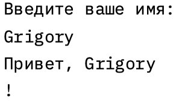
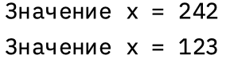
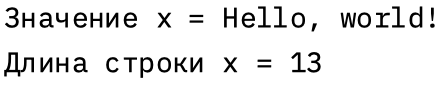
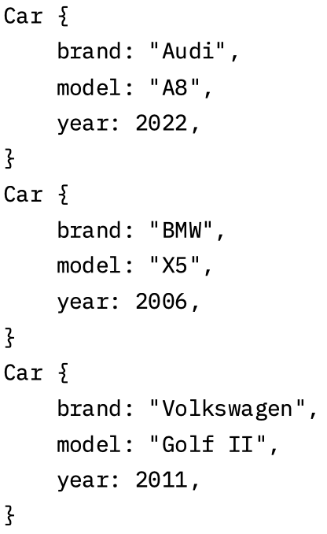
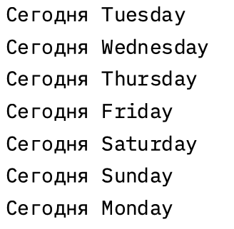
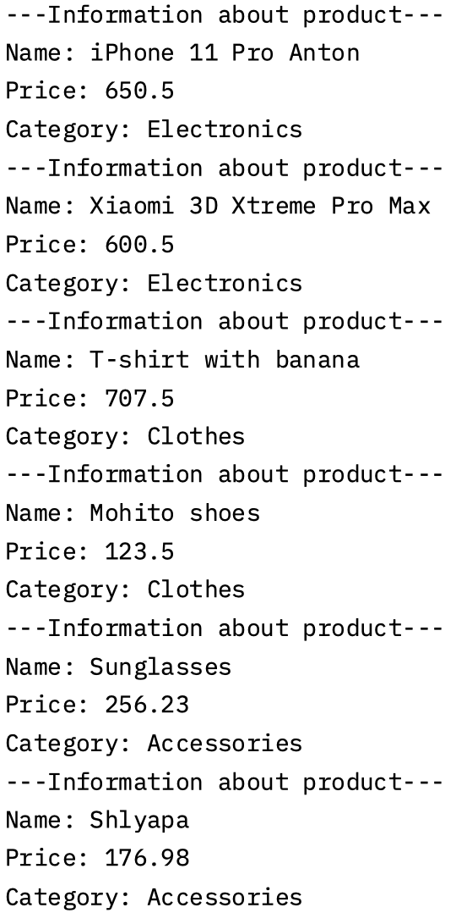

# Задача 1
Напишите программу, которая запрашивает у пользователя имя и выводит на экран приветственное сообщение с использованием этого имени.
## Математическая модель

не требуется
## Список идентификаторов

| Имя      | Тип    | Смысл                                    |
| -------- | ------ | ---------------------------------------- |
| username | String | Переменная для хранения имя пользователя |

## Код программы
``` rust
use std::io;

fn main() {
    println!("Введите ваше имя:");
    let mut username = String::new();
    io::stdin()
        .read_line(&mut username)
        .expect("Ошибка при чтении строки");
    println!("Привет, {}!", username);
}

```
## Результат программы


---
# Задача 2
Создайте переменную типа целое беззнаковое число и выведите ее значение на экран. Явно укажите тип переменной. Затем измените значение переменной и снова выведите его.
## Математическая модель
```
x = 242;
x = 123;
```
## Список идентификаторов

| Имя | Тип | Смысл                         |
| --- | --- | ----------------------------- |
| x   | u8  | Переменная для хранения числа |

## Код программы
``` rust
fn main() {
    let mut x: u8 = 242;
    println!("Значение x = {}", x);
    x = 123;
    println!("Значение x = {}", x);
}

```
## Результат программы


---
# Задача 3
Напишите функцию, которая принимает строку и возвращает ее длину (количество символов). Затем вызовите эту функцию с различными строками.
## Математическая модель

## Список идентификаторов

| Имя | Тип    | Смысл                               |
| --- | ------ | ----------------------------------- |
| x   | String | Для хранения строки "Hello, world!" |

## Код программы
``` rust
fn len(s: &str) -> usize {
    // usize - это тип данных, который используется для хранения целых чисел без знака.
    s.chars().count // chars - количество символов в строке, count - количество символов в строке
}

fn main() {
    let x = "Hello, world!";
    println!("Значение x = {}", x);
    println!("Длина строки x = {}", len(x));
}

```
## Результат программы


---
# Задача 4
Задайте структуру Car с полями brand, model и year, и создайте несколько экземпляров этой структуры. Выведите информацию о каждой машине на экран.
## Математическая модель
не требуется
## Список идентификаторов

| Имя        | Тип    | Смысл                                                          |
| ---------- | ------ | -------------------------------------------------------------- |
| Audi       | Car    | Описание машины Audi                                           |
| Bmw        | Car    | Описание машины Bmw                                            |
| Volkswagen | Car    | Описание машины Volkswagen                                     |
| Car        | struct | Структура машины содержащая: брэнд, модель, и год производства |
## Код программы
``` rust
#[derive(Debug)]

struct Car {
    brand: String,
    model: String,
    year: u32,
}

fn main() {
    let Audi = Car {
        brand: "Audi".to_string(),
        model: "A8".to_string(),
        year: 2022,
    };
    println!("{:#?}", Audi);

    let Bmw = Car {
        brand: "BMW".to_string(),
        model: "X5".to_string(),
        year: 2006,
    };
    println!("{:#?}", Bmw);

    let Volkswagen = Car {
        brand: "Volkswagen".to_string(),
        model: "Golf II".to_string(),
        year: 2011,
    };
    println!("{:#?}", Volkswagen);
}

```
## Результат программы


---
# Задача 5
Напишите программу, которая запрашивает у пользователя число 𝑁 и выводит на экран 𝑁ное число Фибоначчи. Используйте рекурсию для решения этой задачи.
## Математическая модель
$f(n-1) + f(n-1)$
## Список идентификаторов

| Имя               | Тип    | Смысл                                              |
| ----------------- | ------ | -------------------------------------------------- |
| fibonachi_match   | fn     | Метод вычисления чисел Фибоначи методом match      |
| fibonachi_if_else | fn     | Метод вычисления чисел Фибоначи методом if else    |
| n                 | String | Переменная для записи числа введеным пользователем |
| number            | u32    |                                                    |
## Код программы
``` rust
use std::io;

fn fibonachi_match(n: u32) -> u32 {
    match n {
        0 => 0,
        1 => 1,
        _ => fibonachi_match(n - 1) + fibonachi_match(n - 2),
    }
}

fn fibonachi_if_else(n: u32) -> u32 {
    if n == 0 {
        0
    } else if n == 1 {
        1
    } else {
        fibonachi_if_else(n - 1) + fibonachi_if_else(n - 2)
    }
}

fn main() {
    println!("Введите число, до которого будут выводится числа Фибоначчи");

    let mut n = String::new();
    io::stdin().read_line(&mut n).expect("Ошибка ввода");

    let number: u32 = n.trim().parse().expect("Ошибка ввода");

    println!("Введено число {}", number);
    println!("Числа Фибоначчи до используя match {}:", number);
    for i in 0..number {
        println!("{}", fibonachi_match(i));
    }

    println!("Числа Фибоначчи до используя if_else {}:", number);
    for i in 0..number {
        println!("{}", fibonachi_if_else(i));
    }
}


```
## Результат программы
![[5.png]]

---
# Задача 6
Реализуйте перечисление DayOfWeek для дней недели. Напишите функцию, которая принимает день недели и возвращает следующий день. Обработайте случаи перехода на следующий день недели, если текущий день – воскресенье.
## Математическая модель
не требуется
## Список идентификаторов

| Имя     | Тип    | Смысл                                       |
| ------- | ------ | ------------------------------------------- |
| WeekDay | enum   | Перечисление дней недели                    |
| today   | String | Переменная для записи текущего дня недели   |
| WeekDay | impl   | Метод с match для "переключения" дня недели |
## Код программы
``` rust
enum WeekDay {
    Monday,
    Tuesday,
    Wednesday,
    Thursday,
    Friday,
    Saturday,
    Sunday,
}

impl WeekDay {
    fn name(&self) -> &str {
        match self {
            WeekDay::Monday => "Tuesday",
            WeekDay::Tuesday => "Wednesday",
            WeekDay::Wednesday => "Thursday",
            WeekDay::Thursday => "Friday",
            WeekDay::Friday => "Saturday",
            WeekDay::Saturday => "Sunday",
            WeekDay::Sunday => "Monday",
        }
    }
}

fn main() {
    let mut today = WeekDay::Monday;
    println!("Сегодня {}", today.name());
    today = WeekDay::Tuesday;
    println!("Сегодня {}", today.name());
    today = WeekDay::Wednesday;
    println!("Сегодня {}", today.name());
    today = WeekDay::Thursday;
    println!("Сегодня {}", today.name());
    today = WeekDay::Friday;
    println!("Сегодня {}", today.name());
    today = WeekDay::Saturday;
    println!("Сегодня {}", today.name());
    today = WeekDay::Sunday;
    println!("Сегодня {}", today.name());
}

```
## Результат программы


---
# Задача 7
Создайте структуру Product с полями name, price и category, а также перечисление (enum) Category для категорий товаров. Напишите метод для вывода информации о продукте и ассоциированную функцию для подсчета общей суммы товаров в заданной категории из массива продуктов.
## Математическая модель

## Список идентификаторов

| Имя           | Тип      | Смысл                                                       |
| ------------- | -------- | ----------------------------------------------------------- |
| product       | struct   | Структура продукта имеющая: имя, цену, категорию            |
| Category      | enum     | Перечисление категорий                                      |
| category_info | fn       | Функция с получением информацией в зависимости от категорий |
| information   | fn       | Функция для вывода информации о продукте                    |
| products      | products | Функция с хранением 6 перечислений о продуктах              |
## Код программы
``` rust
struct product {
    name: String,
    price: f64,
    category: Category,
}

enum Category {
    Electronics,
    Clothes,
    Accessories,
}

impl Category {
    fn category_info(&self) {
        match self {
            Category::Electronics => print!("Electronics"),
            Category::Clothes => print!("Clothes"),
            Category::Accessories => print!("Accessories"),
        }
    }
}

impl product {
    fn information(&self) {
        println!("---Information about product---");
        println!("Name: {}", self.name);
        println!("Price: {}", self.price);
        print!("Category: ");
        self.category.category_info();
        println!("");
    }
}
fn main() {
    let products: [product; 6] = [
        product {
            name: String::from("iPhone 11 Pro Anton"),
            price: 650.50,
            category: Category::Electronics,
        },
        product {
            name: String::from("Xiaomi 3D Xtreme Pro Max"),
            price: 600.50,
            category: Category::Electronics,
        },
        product {
            name: String::from("T-shirt with banana"),
            price: 707.50,
            category: Category::Clothes,
        },
        product {
            name: String::from("Mohito shoes"),
            price: 123.50,
            category: Category::Clothes,
        },
        product {
            name: String::from("Sunglasses"),
            price: 256.23,
            category: Category::Accessories,
        },
        product {
            name: String::from("Shlyapa"),
            price: 176.98,
            category: Category::Accessories,
        },
    ];
    for i in products {
        i.information();
    }
}

```
## Результат программы


---
# Задача 8
Создайте структуру Employee с полями name, position, salary, а также перечисление Position для должностей сотрудников. Напишите функцию, которая принимает вектор сотрудников и возвращает вектор сотрудников заданной должности.
## Математическая модель

## Список идентификаторов

| Имя               | Тип                     | Смысл                                                                 |
|--------------------|--------------------------|-----------------------------------------------------------------------|
| Employee           | struct                   | Структура, представляющая сотрудника с именем, должностью и зарплатой |
| name               | String                   | Имя сотрудника                                                       |
| position           | Position                 | Должность сотрудника (из перечисления Position)                      |
| salary             | u32                      | Зарплата сотрудника в долларах                                       |
| Position           | enum                     | Перечисление возможных должностей сотрудников                        |
| BadGuy             | Position (вариант enum)  | Одна из должностей - "Плохой парень"                                 |
| Normalni           | Position (вариант enum)  | Одна из должностей - "Обычный"                                       |
| Boss               | Position (вариант enum)  | Одна из должностей - "Босс"                                          |
| OmegaLulBoss       | Position (вариант enum)  | Одна из должностей - "Мега крутой босс"                              |
| print              | method (для Position)    | Метод для печати названия должности                                  |
| print              | method (для Employee)    | Метод для печати информации о сотруднике                             |
| choose_by_position | function                 | Функция для фильтрации сотрудников по должности                      |
| Employees          | Vec<Employee>            | Вектор (список) сотрудников в функции main                           |
| employee           | &Employee                | Ссылка на сотрудника в итерациях и функциях                          |
## Код программы
``` rust
struct Employee {
    name: String,
    position: Position,
    salary: u32,
}
#[derive(PartialEq)]
enum Position {
    BadGuy,
    Normalni,
    Boss,
    OmegaLulBoss,
}
impl Position {
    fn print(&self) {
        match self {
            Position::BadGuy => print!("Bad Guy"),
            Position::Normalni => print!("Normalni"),
            Position::Boss => print!("Boss"),
            Position::OmegaLulBoss => print!("Omega Lul Boss"),
        }
    }
}

impl Employee {
    fn print(&self) {
        println!("---Info about employee---");
        println!("Name: {}", self.name);
        println!("Position:");
        self.position.print();
        println!("");
        println!("Salary: {}$", self.salary);
        println!("---End of info---");
        println!("");
    }
}

fn choose_by_position(position: Position, Employees: &[Employee]) -> Vec<&Employee> {
    Employees
        .iter()
        .filter(|employee| employee.position == position)
        .collect()
}

fn main() {
    let Employees: Vec<Employee> = vec![
        Employee {
            name: String::from("AntonPush"),
            position: Position::BadGuy,
            salary: 50,
        },
        Employee {
            name: String::from("AndrewBandit"),
            position: Position::BadGuy,
            salary: 75,
        },
        Employee {
            name: String::from("EminHach"),
            position: Position::Normalni,
            salary: 200,
        },
        Employee {
            name: String::from("FlashEnergy"),
            position: Position::Boss,
            salary: 450,
        },
        Employee {
            name: String::from("GrigoryMuscleMan"),
            position: Position::OmegaLulBoss,
            salary: 100000,
        },
        Employee {
            name: String::from("Penal"),
            position: Position::OmegaLulBoss,
            salary: 50550505,
        },
    ];

    for employee in choose_by_position(Position::BadGuy, &Employees) {
        employee.print();
    }
    for employee in choose_by_position(Position::Normalni, &Employees) {
        employee.print();
    }
    for employee in choose_by_position(Position::Boss, &Employees) {
        employee.print();
    }
    for employee in choose_by_position(Position::OmegaLulBoss, &Employees) {
        employee.print();
    }
}

```
## Результат программы
```rust
---Info about employee---
Name: AntonPush
Position:
Bad Guy
Salary: 50$
---End of info---

---Info about employee---
Name: AndrewBandit
Position:
Bad Guy
Salary: 75$
---End of info---

---Info about employee---
Name: EminHach
Position:
Normalni
Salary: 200$
---End of info---

---Info about employee---
Name: FlashEnergy
Position:
Boss
Salary: 450$
---End of info---

---Info about employee---
Name: GrigoryMuscleMan
Position:
Omega Lul Boss
Salary: 100000$
---End of info---

---Info about employee---
Name: Penal
Position:
Omega Lul Boss
Salary: 50550505$
---End of info---
```