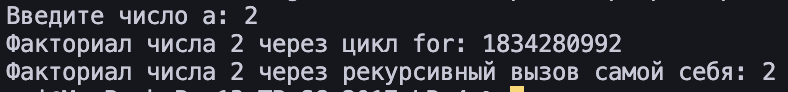
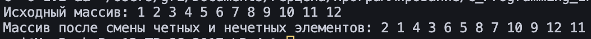
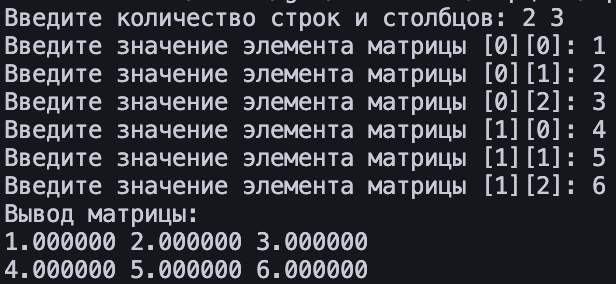
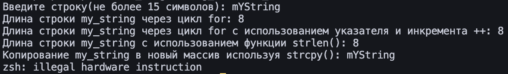
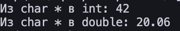

## Введение в функции. Базовая работа со строками  
**Студент:** Курылев Григорий Алексеевич  
**Курс:** 1  
**Группа:** ИВТ-2

---

# Задание 1.1 — Факториал числа (цикл и рекурсия)

## Постановка задачи
Создайте две функции, которые вычисляют факториал числа:
- одну — с использованием цикла;
- другую — с использованием рекурсии.

## Математическая модель
Факториал `n!` — произведение всех натуральных чисел от 1 до `n`.
- Рекурсия: `n! = n * (n-1)!`, `1! = 1`
- Цикл: Итеративное перемножение от 1 до `n`

## Список идентификаторов

| Имя           | Тип                  | Назначение                         |
|---------------|----------------------|------------------------------------|
| `fact_for`    | `unsigned long long` | Функция, вычисляющая факториал циклом |
| `fact_rec`    | `unsigned long long` | Рекурсивная функция факториала    |
| `a`           | `int`                | Вводимое пользователем число       |

## Код программы

```c
#include <stdio.h>

unsigned long long fact_for(int n){
    unsigned long long res = 1;
    for (int i = 1; i <= n; i++){
        res *= i;
    }
    return res;
}

unsigned long long fact_rec(int n){
    if (n <= 1) return 1;
    else return n * fact_rec(n-1);
}

int main(){
    int a;
    printf("Введите число a: ");
    scanf("%d", &a);
    printf("Факториал числа %d через цикл for: %llu\n", a, fact_for(a));
    printf("Факториал числа %d через рекурсию: %llu\n", a, fact_rec(a));
    return 0;
}
```

### Результаты работы программы  


---

# Задание 1.2

## Постановка задачи
Выделить память для массива на 12 элементов. Создать функцию, которая изменяет значения чётных и нечётных ячеек.
## Список идентификаторов

| Имя        | Тип      | Назначение                              |
|------------|----------|------------------------------------------|
| `arr`      | `int*`   | Динамический массив                      |
| `size`     | `int`    | Размер массива                           |
| `change_cell` | `void` | Функция изменения значений               |

## Код программы

```c
#include <stdio.h>
#include <stdlib.h>

void change_cell(int *arr, int size){
    for (int i = 0; i < size; i += 2){
        arr[i] += 1;
    }
    for (int i = 1; i < size; i += 2){
        arr[i] -= 1;
    }
}

int main(void){
    int size = 12;
    int *arr = (int*)malloc(size * sizeof(int));

    if(arr == NULL){
        printf("Ошибка выделения памяти");
        return 1;
    }

    for (int i = 0; i < size; i++){
        arr[i] = i + 1;
    }

    printf("Исходный массив: ");
    for (int i = 0; i < size; i++){
        printf("%d ", arr[i]);
    }
    printf("\n");

    change_cell(arr, size);

    printf("Массив после изменений: ");
    for (int i = 0; i < size; i++){
        printf("%d ", arr[i]);
    }
    printf("\n");

    free(arr);
    return 0;
}
```

### Результаты работы программы  


---
# Задание 1.3

## Постановка задачи
Создать функции:
- для выделения и освобождения памяти под матрицу типа `double`;
- для заполнения и вывода этой матрицы.

## Список идентификаторов

| Имя               | Тип         | Назначение                              |
|--------------------|-------------|------------------------------------------|
| `memory_for_matrix`| `double**`  | Выделение памяти под матрицу             |
| `free_memory_matrix` | `void`    | Освобождение памяти                      |
| `fill_matrix`      | `double**`  | Заполнение матрицы                      |
| `print_matrix`     | `void`      | Вывод матрицы на экран                   |

## Код программы

```c
#include <stdio.h>
#include <stdlib.h>

double** memory_for_matrix(int rows, int cols){
    double** arr = (double**)malloc(rows * sizeof(double*));
    arr[0] = (double*)malloc(rows * cols * sizeof(double));
    for(int i = 1; i < rows; i++){
        arr[i] = arr[0] + i * cols;
    }
    return arr;
}

void free_memory_matrix(double** arr){
    if (arr != NULL){
        free(arr[0]);
        free(arr);
    }
}

double** fill_matrix(double** arr, int rows, int cols){
    for (int i = 0; i < rows; i++){
        for(int j = 0; j < cols; j++){
            printf("Введите значение элемента матрицы [%d][%d]: ", i, j);
            scanf("%lf", &arr[i][j]);
        }
    }
    return arr;
}

void print_matrix(double** arr, int rows, int cols) {
    for (int i = 0; i < rows; i++) {
        for (int j = 0; j < cols; j++) {
            printf("%lf ", arr[i][j]);
        }
        printf("\n");
    }
}

int main(void) {
    int rows, cols;
    printf("Введите количество строк и столбцов: ");
    scanf("%d %d", &rows, &cols);
    double** arr = memory_for_matrix(rows, cols);
    arr = fill_matrix(arr, rows, cols);
    printf("Вывод матрицы:\n");
    print_matrix(arr, rows, cols);
    free_memory_matrix(arr);
    return 0;
}
```

## Результаты работы программы  


---

# Задание 1.4
## Задача
Создать функцию, которая вычисляет векторное произведение двух векторов в декартовых координатах, используя указатели на соответствующие массивы.
## Математическая модель
``` python
c1 = ay * bz - az * by, 
c2 = az * bx - ax * bz, 
c3 = ax * by - ay * bx.
```
## Список идентификаторов

| Имя                  | Тип    | Смысл                                                             |
| -------------------- | ------ | ----------------------------------------------------------------- |
| vector_cross_product | void   | Функция векторного произведение векторов в декартовых координатах |
| a                    | double | Вектор а                                                          |
| b                    | double | Вектор b                                                          |
| result               | double | Результат                                                         |

```c
#include <stdio.h>

void vector_cross_product(const double *a, const double *b, double *result) {
    result[0] = a[1] * b[2] - a[2] * b[1];
    result[1] = a[2] * b[0] - a[0] * b[2];
    result[2] = a[0] * b[1] - a[1] * b[0];
}

int main(){
    double a[3] = {1.0, 2.0, 3.0};
    double b[3] = {4.0, 5.0, 6.0};
    double result[3];
    vector_cross_product(a, b, result);
    printf("Векторное произведение: [%.2f, %.2f, %.2f]\n", result[0], result[1], result[2]);
    return 0;
}
```

### Результат работы программы


---
## Задание 2.1
## Задача
Создайте новую программу, где с клавиатуры вводится строка некоторой длины порядка 10 латинских символов (не используйте кириллицу) в классическую строку языка C, которая имеет вид массива

```c
char my_string[MY_SIZE];
```

`MY_SIZE` определите с помощью директивы

```c
#define
```

Значение `MY_SIZE` должно превышать длину вводимой строки с некоторым разумным запасом. Другие строки в этой задаче можете создавать либо также как статические массивы, либо как динамические массивы, но не забывайте освобождать динамически выделенную память с помощью функции

```c
void free(void* ptr);
```

Выполните следующие действия и распечатайте результаты:

1. Вычислите длину строки `my_string`, используя цикл `for` и тот факт, что в языке C такие строки имеют в конце специальный нулевой символ конца строки, представленный escape-последовательностью `'\0'` (`'...'` — это тип `char`).
    
2. Сделайте то же самое, что в пункте 1, но создайте указатель на начало вашей строки и используйте операцию инкремента `++`.
    
3. Используйте функции:
    

```c
size_t strlen(const char* str);
size_t strnlen(const char* string, size_t maxlen);
size_t strnlen_s(const char* str, size_t strsz);
```

для получения размера строки в виде значения `size_t` (псевдоним `unsigned int`, спецификатор форматирования — `"%zu"`). Убедитесь, что ваш компилятор явно работает с опцией `-std=c11` или с опцией для более позднего стандарта языка для поддержки функции `strnlen_s`.

4. Создайте вторую строку (второй массив) и скопируйте в неё строку `my_string`, используя функцию:
    

```c
char* strcpy(char* dest, const char* src);
char* strncpy(char* dest, const char* src, size_t n);
```

5. Создайте ещё две строки какого-либо размера и задайте их прямо в коде без клавиатуры. Сделайте конкатенацию этих двух строк, используя:
    

```c
char* strcat(char* dest, const char* src);
char* strncat(char* dest, const char* src, size_t n);
```

Первую строку трактуйте как `dest` (destination) и подберите размер этого массива с запасом.

6. Сравните две новые строки, заданные в коде строковыми литералами, используя функцию:
    

```c
int strcmp(const char* lhs, const char* rhs);
int strncmp(const char* s1, const char* s2, size_t n);
```

7. Задайте прямо в коде строку, в которой есть только латинские символы в верхнем и нижнем регистре. Переведите строку полностью в нижний регистр и отдельно — полностью в верхний регистр. Распечатайте каждый результат отдельно. Найдите сигнатуры подходящих функций (`tolower` и `toupper`).
    

---
## Математическая модель
не требуется
## Список идентификаторов
| Имя           | Тип             | Смысл/Назначение                    |
| ------------- | --------------- | ----------------------------------- |
| my_string     | `char[MY_SIZE]` | Массив для ввода строки             |
| len           | `size_t`        | Длина строки (через `strlen`)       |
| length        | `int`           | Длина строки (через цикл/указатель) |
| ptr           | `char *`        | Указатель для перебора строки       |
| second_string | `char[MY_SIZE]` | Массив для копирования строки       |
| dest          | `char[50]`      | Массив для конкатенации             |
| fourth_string | `char[15]`      | Вторая строка для конкатенации      |
| str1          | `char *`        | Первая строка для сравнения         |
| str2          | `char *`        | Вторая строка для сравнения         |
| result        | `int`           | Результат сравнения строк           |
| str3          | `char[]`        | Строка для преобразования регистра  |
## Код программы
``` c
#include <string.h>
#include <stdio.h>
#include <stdlib.h>
#include <ctype.h>
#define MY_SIZE 15

int main(){
    // иницилизируем массив и вводим с клавиатуры
    printf("Введите строку(не более %d символов): ", MY_SIZE);
    char my_string[MY_SIZE];
    fgets(my_string, MY_SIZE, stdin);

    // удаляем символ новой строки, если он есть
    size_t len = strlen(my_string);
    int length = 0; // длина
    //1. вычисление длины строки my_string 
    for(int i = 0; my_string[i] != '\0'; i++){
        length = length + 1;
    }
    printf("Длина строки my_string через цикл for: %d\n",length);
    //2. тоже самое что в пункте 1, но с использованием указателя и инкремента ++
    length = 0;
    char *ptr;
    for (ptr = my_string; *ptr != '\0'; ptr++){
        length++;
    }
    printf("Длина строки my_string через цикл for с использованием указателя и инкремента ++: %d", length);
    printf("\n");
    //3. использования функции strlen 
    printf("Длина строки my_string с использованием функции strlen(): %zu", strlen(my_string));
    printf("\n");
    //4. копирование my_string в новый массив используя strcpy
    char second_string[MY_SIZE];
    strcpy(second_string, my_string); // strcpy(destination "куда", source "откуда")
    printf("Копирование my_string в новый массив используя strcpy(): %s", second_string);

    //5. конкатенация двух строк(соединение двух строк в одну)
    char dest[50] = {"3яСтрока"};
    char fourth_string[15] = {"4яСтрока"};
    if (strlen(dest) + strlen(fourth_string) < 50){   
        strcat(dest, fourth_string);
        printf("Конкатенация двух строк: %s\n", dest);
    } else {
        printf("ERROR: недостаточно места в массиве dest[50]");
        return 1;
    }

    //6. сравнение через strcmp
    char *str1 = "mandarin";
    char *str2 = "apelsin";

    int result = strcmp(str1, str2);

    if (result == 0){
        printf("Строки идентичны\n");
    } else if(result < 0){
        printf("'%s' меньше '%s'\n", str1, str2);
    } else{
        printf("'%s' больше '%s'\n", str1, str2);
    }

    //7. tolower(), toupper()
    char str3[] = "HeLlO";

    for(int i = 0; str3[i] != '\0'; i++){
        str3[i] = tolower(str3[i]);
    }
    printf("Слово в нижнем регистру: %s", str3);
    printf("\n");

    for(int i = 0; str3[i] != '\0'; i++){
        str3[i] = toupper(str3[i]);
    }
    printf("Слово в верхнем регистре: %s", str3);
    printf("\n");

    return 0;
}
```
## Результат программы


---
## Задача 2.2
Конвертируйте введённые заданные как строки: число с плавающей точкой (double) и целое число (int) в значения типа double и int, используя функциями atof и atoi.
## Математическая модель
не требуется
## Список идентификаторов

| Имя     | Тип   | Смысл                                     |
| ------- | ----- | ----------------------------------------- |
| string  | char* | Задача строки с числом с плавающей точкой |
| integer | char* | Задача числа                              |

## Код программы
``` c
#include <stdio.h>
#include <stdlib.h>

int main(void){
    char* string = "20.06";
    char* integer = "42";

    printf("Из char * в int: %d\n", atoi(integer));
    printf("Из char * в double: %.2f\n", atof(string));
}
```
## Результат программы



---
## Задача 2.3
Создайте строку от 10 до 20 символов, используя только цифры, ла-
тинский буквы в разных регистрах пробельные символы и символы
пунктуации. Организуйте цикл, где каждый символ подробно тестируется функциями типа int is∗(/∗... ∗/) (например — isdigit, ispunct). Оформите распечатку информации по каждому символу в виде списка на экране, чтобы можно было прочесть информацию о том что представляет из себя каждый символ (своими словами, в свободной форме). Постарайтесь использовать только латиницу.
## Математическая модель
не требуется
## Список идентификаторов

| Имя | Тип    | Смысл          |
| --- | ------ | -------------- |
| a   | char[] | Набор символов |

## Код программы
``` c
#include <stdio.h>
#include <string.h>
#include <ctype.h>

int main(void){
    char a[] = "AbCd,.123EfG!@#$"; // 16 символов

    for (int i = 0; i < strlen(a); i++){
        printf("Символ: %c\n", a[i]);
        isalnum(a[i]) > 0 ? printf("isalnum = True\n") : printf("isalnum = False\n");
        isalpha(a[i]) > 0 ? printf("isalpha = True\n") : printf("isalpha = False\n");
        islower(a[i]) > 0 ? printf("islower = True\n") : printf("islower = False\n");
        isupper(a[i]) > 0 ? printf("isupper = True\n") : printf("isupper = False\n");
        isdigit(a[i]) > 0 ? printf("isdigit = True\n") : printf("isdigit = False\n");
        isxdigit(a[i]) > 0 ? printf("isxdigit = True\n") : printf("isxdigit = False\n");
        iscntrl(a[i]) > 0 ? printf("iscntrl = True\n") : printf("iscntrl = False\n");
        isgraph(a[i]) > 0 ? printf("isgraph = True\n") : printf("isgraph = False\n");
        isspace(a[i]) > 0 ? printf("isspace = True\n") : printf("isspace = False\n");
        isblank(a[i]) > 0 ? printf("isblank = True\n") : printf("isblank = False\n");
        isprint(a[i]) > 0 ? printf("isprint = True\n") : printf("isprint = False\n");
        ispunct(a[i]) > 0 ? printf("ispunct = True\n") : printf("ispunct = False\n");
        printf("\n");
    }
}
```
## Результат программы
``` c
Символ: A
isalnum = True
isalpha = True
islower = False
isupper = True
isdigit = False
isxdigit = True
iscntrl = False
isgraph = True
isspace = False
isblank = False
isprint = True
ispunct = False

Символ: b
isalnum = True
isalpha = True
islower = True
isupper = False
isdigit = False
isxdigit = True
iscntrl = False
isgraph = True
isspace = False
isblank = False
isprint = True
ispunct = False

Символ: C
isalnum = True
isalpha = True
islower = False
isupper = True
isdigit = False
isxdigit = True
iscntrl = False
isgraph = True
isspace = False
isblank = False
isprint = True
ispunct = False

Символ: d
isalnum = True
isalpha = True
islower = True
isupper = False
isdigit = False
isxdigit = True
iscntrl = False
isgraph = True
isspace = False
isblank = False
isprint = True
ispunct = False

Символ: ,
isalnum = False
isalpha = False
islower = False
isupper = False
isdigit = False
isxdigit = False
iscntrl = False
isgraph = True
isspace = False
isblank = False
isprint = True
ispunct = True

Символ: .
isalnum = False
isalpha = False
islower = False
isupper = False
isdigit = False
isxdigit = False
iscntrl = False
isgraph = True
isspace = False
isblank = False
isprint = True
ispunct = True

Символ: 1
isalnum = True
isalpha = False
islower = False
isupper = False
isdigit = True
isxdigit = True
iscntrl = False
isgraph = True
isspace = False
isblank = False
isprint = True
ispunct = False

Символ: 2
isalnum = True
isalpha = False
islower = False
isupper = False
isdigit = True
isxdigit = True
iscntrl = False
isgraph = True
isspace = False
isblank = False
isprint = True
ispunct = False

Символ: 3
isalnum = True
isalpha = False
islower = False
isupper = False
isdigit = True
isxdigit = True
iscntrl = False
isgraph = True
isspace = False
isblank = False
isprint = True
ispunct = False

Символ: E
isalnum = True
isalpha = True
islower = False
isupper = True
isdigit = False
isxdigit = True
iscntrl = False
isgraph = True
isspace = False
isblank = False
isprint = True
ispunct = False

Символ: f
isalnum = True
isalpha = True
islower = True
isupper = False
isdigit = False
isxdigit = True
iscntrl = False
isgraph = True
isspace = False
isblank = False
isprint = True
ispunct = False

Символ: G
isalnum = True
isalpha = True
islower = False
isupper = True
isdigit = False
isxdigit = False
iscntrl = False
isgraph = True
isspace = False
isblank = False
isprint = True
ispunct = False

Символ: !
isalnum = False
isalpha = False
islower = False
isupper = False
isdigit = False
isxdigit = False
iscntrl = False
isgraph = True
isspace = False
isblank = False
isprint = True
ispunct = True

Символ: @
isalnum = False
isalpha = False
islower = False
isupper = False
isdigit = False
isxdigit = False
iscntrl = False
isgraph = True
isspace = False
isblank = False
isprint = True
ispunct = True

Символ: #
isalnum = False
isalpha = False
islower = False
isupper = False
isdigit = False
isxdigit = False
iscntrl = False
isgraph = True
isspace = False
isblank = False
isprint = True
ispunct = True

Символ: $
isalnum = False
isalpha = False
islower = False
isupper = False
isdigit = False
isxdigit = False
iscntrl = False
isgraph = True
isspace = False
isblank = False
isprint = True
ispunct = True
```